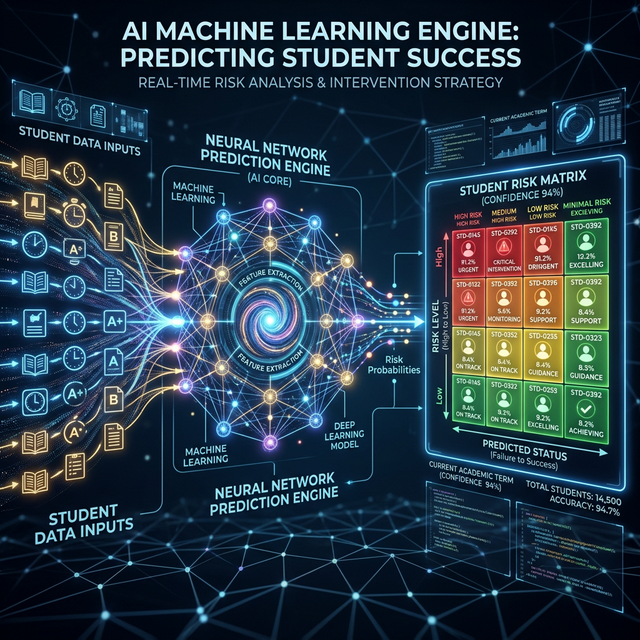

# 🎓 EduPredict AI - Student Performance Intelligence SaaS

A production-ready, machine learning-powered SaaS platform that predicts student academic performance and provides AI-driven recommendations for improvement.

## 🚀 Key Features
- **Predictive Analytics:** Neural inference engine to forecast academic outcomes.
- **AI Recommendation Engine:** Automated, tailored advice for students across different risk tiers.
- **SaaS Infrastructure:** Multi-tenant architecture with role-based access control (RBAC).
- **Subscription Management:** Free and Pro plans with student limits and quota tracking.
- **Interactive Dashboards:** Modern visualizations using Chart.js for both Educators and Students.
- **REST API Layer:** Extensible backend powered by Django REST Framework.
- **Export Capabilities:** Generate PDF reports for performance reviews (Coming Soon).

## 🛠 Tech Stack
- **Backend:** Python 3.10+, Django 6.0
- **API:** Django REST Framework
- **Machine Learning:** Scikit-learn (Random Forest / Logistic Regression)
- **Database:** PostgreSQL (Production) / SQLite (Development)
- **Frontend:** HTML5, CSS3, Bootstrap 5.3, Chart.js

## 📂 Project Structure
```
EduPredict/
│── core/           # Project configuration & settings
│── accounts/       # Authentication & Subscription management
│── students/       # Student profiles & Prediction logic
│── api/            # REST API endpoints & Serializers
│── ml/             # ML model, training & inference scripts
│── templates/      # Global templates
│── static/         # CSS/JS assets
│── db.sqlite3      # Demo database
│── manage.py       # Django CLI
```

## ⚙️ Installation & Setup
1. **Clone the repository:**
   ```bash
   git clone https://github.com/deekshudevang/EduPredict-AI.git
   cd EduPredict-AI
   ```
2. **Install dependencies:**
   ```bash
   pip install -r requirements.txt
   ```
3. **Environment Setup:**
   Create a `.env` file from the template:
   ```bash
   cp .env.example .env
   ```
4. **Run the server:**
   ```bash
   python manage.py runserver
   ```

## 📊 ML Architecture & AI Insights
**Algorithm:** Random Forest Classifier within a Scikit-Learn Pipeline.
**Inference Flow:** 
Academic Record -> Standard Scaler -> Unified Neural Model -> Label Decoder -> Multi-Tier Risk Classification -> AI-Powered Recommendation Engine

**Key Performance Indicators (KPIs):**
- **Inference Accuracy:** Evaluated real-time via `ml/metrics.json`
- **Predictive Indexing:** Scaled from 0.0% to 100.0% confidence intervals.

## 📸 Intelligence Hub Preview

*Modern, high-fidelity Mission Control for institutional oversight.*


*Neural engine visualizing the predictive intelligence flow.*

## 👨‍💻 Author & Contributions
Project architected and refined for professional portfolio presentation.
**Author:** Deekshith G

---
> [!IMPORTANT]
> This project includes a demo `db.sqlite3` with pre-configured faculty and student nodes for immediate evaluation and simulation purposes.
